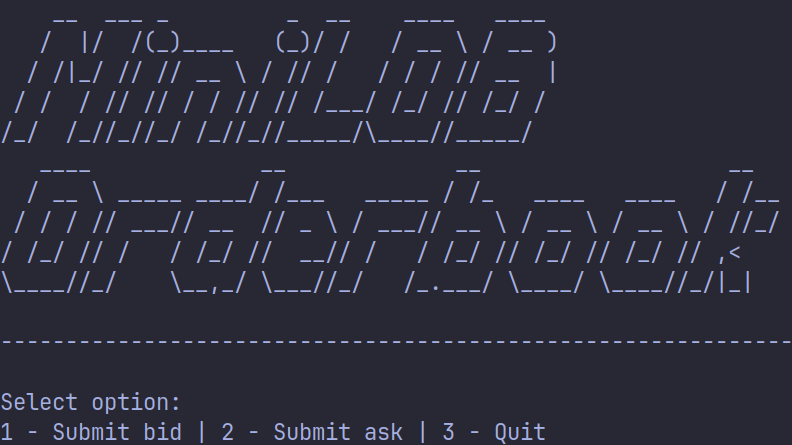
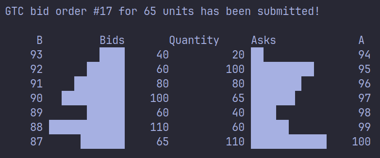
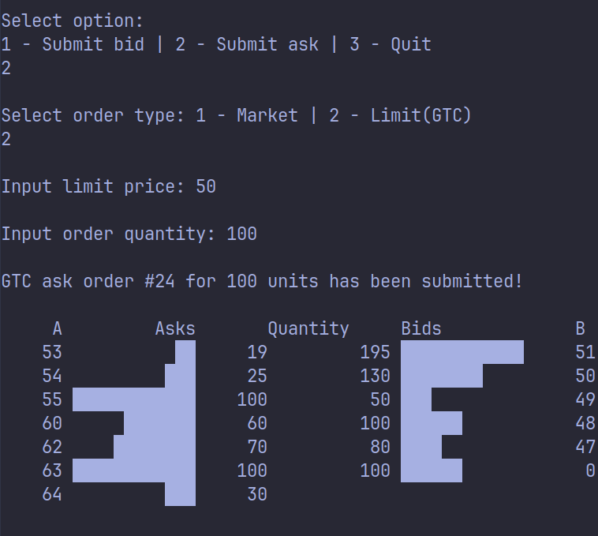

# mini-lob

Order matching system with visualizer written in C++. 

## Implementation

The orderbook maintains its state within two seperate red-black binary trees implemented via tree-maps. Each individual tree corresponds to either the buy or sell limits of the book and each tree is comprised of list objects containing orders. Each limit is mapped with its corresponding limit price as a key and all orders are also mapped by a unique orderID key.

Using this data structure the orderbook is able to accomplish order addition, cancellation and execution all with an average time complexity of O(1).

---

 
Example orderbook state
  
Example market order fill

---

## Quickstart

To compile and start the orderbook, run the following commands:

1. Clone repo: git clone https://github.com/4b41/mini-lob.git
2. Select directory: cd mini-lob
3. Compile program: g++ -std=c++20 -Iinclude src/orderbook.cpp src/feed.cpp src/main.cpp -o Main
4. Run the program: ./Main

## Todo

* Create makefile
