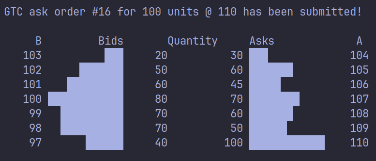
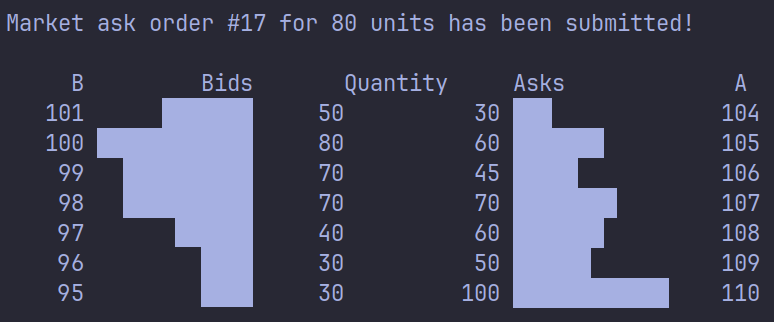

# mini-lob

Order matching system with visualizer written in C++. 

## Quickstart

To compile and start the orderbook, run the following commands:

1. Clone repo: git clone https://github.com/4b41/mini-lob.git
2. Select directory: cd mini-lob
3. Compile program: g++ -std=c++20 -Iinclude src/orderbook.cpp src/feed.cpp src/main.cpp -o Main
4. Run the program: ./Main

## Todo

* Create makefile
* fix screenshots
