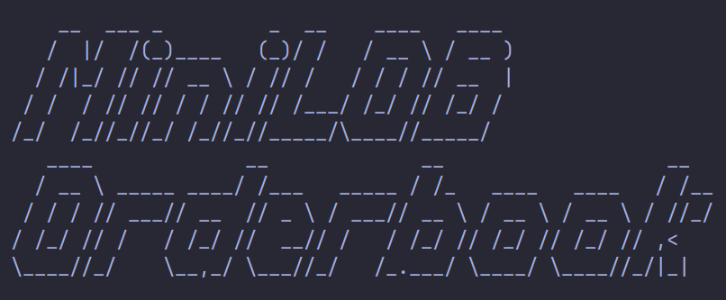

# mini-lob

Order matching system with visualizer written in C++. 

## Implementation

This order book maintains its state using two separate red-black binary trees, implemented as tree maps. Each tree corresponds to either the buy or sell limits of the book and is comprised of list objects containing orders. Each limit is mapped with its corresponding limit price as a key and all orders are also mapped by a unique orderID key.

Using this data structure the orderbook is able to accomplish order addition, cancellation and execution all with an average time complexity of O(1).

---

 
Example orderbook state

  
Example market order fill

---

## Features

* Accepts order input through piping and txt files input to allow backtesting of marketmaking trading strategies.
* Supports Market, GTC, FOK, and GFD order types.
* Allows for order submission, modification, and cancellation.

## Quickstart

To compile and start the orderbook, run the following commands:

1. Clone repo: git clone https://github.com/4b41/mini-lob.git
2. Select directory: cd mini-lob
3. Compile program: g++ -std=c++20 -Iinclude src/orderbook.cpp src/feed.cpp src/main.cpp -o Main
4. Create named pipes (optional): mkfifo OUT_pipe mkfifo INP_pipe
6. Run the program: ./Main

## Todo

* Create makefile
